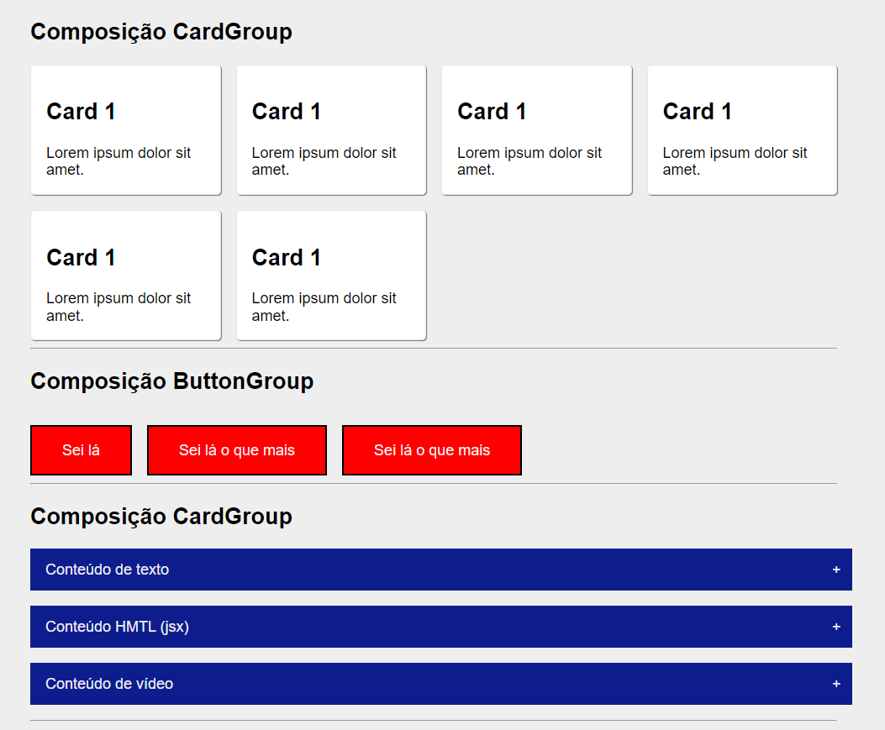

 

# Módulo 01 - Semana 10

 

## Índice

- <a href="#page_facing_up-aula-01---composição">Aula 01 - Composição</a>

---

## :page_facing_up: Aula 01 - Composição

    

**Slides**: [Módulo 1 - Semana 10 - Aula 1](https://docs.google.com/presentation/d/1PiiECMgt8m5T5hspSYb_6IBvqKmgd4oOqSNNL3_88WY/edit#slide=id.g10d952ca74f_0_79)

- criação de componentes com composição e exposição de como compor grupos de componentes ([Button](./src/components/Button/Button.jsx), [Paper](./src/components/Paper/Paper.jsx), [Card](./src/components/Card/CardGroup.jsx));
- demonstração de componentes avançados e utilização da API React.Children ([Accordion](./src/components/Accordion/Accordion.jsx));

Acesse a documentação do [projeto da semana 10](./m01s10/README.md)

---
